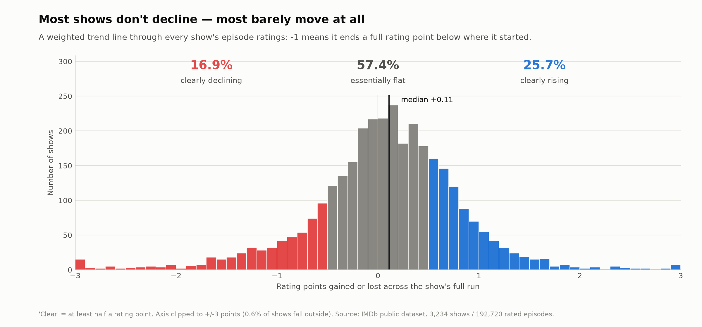

# Decision & Deferred-Task Log

A running record of the design decisions we've locked in and the things we've
consciously postponed. Update this whenever a decision is made or a deferred
item is resolved, so nothing gets lost between phases.

## Finalized inclusion filters

A show is included in the analysis dataset if **all** of the following hold:

| Rule | Value |
|------|-------|
| `titleType` | `tvSeries` or `tvMiniSeries` |
| Minimum episodes (with a rating) | >= 13 |
| Minimum seasons | >= 2 |
| Minimum mean votes per episode | >= 50 |
| Excluded genres | any of Game-Show, Reality-TV, Talk-Show, News |
| Documentary special case | Documentary-tagged is kept only if episode count < 100 |

Rationale, in short:
- **>= 13 episodes**: enough length to talk about a trajectory.
- **>= 2 seasons**: a decline "across seasons" needs at least two seasons to
  compare (e.g. Sherlock has only 15 episodes but 4 seasons, so it stays; the
  single-season anime giants like One Piece / Naruto are dropped).
- **mean votes/episode >= 50**: cuts statistical noise from barely-voted shows
  without narrowing all the way down to only the mega-popular ones.
- **Genre exclusions**: "decline" is a narrative concept; game shows, reality
  TV, talk shows and news have no season-to-season story arc to decline.
- **Documentary < 100 episodes**: separates season-based story documentaries
  (Chef's Table, Drive to Survive, Cheer) from anthology/magazine strands
  (Nova, Frontline, Biography). Platform-independent — we have no channel/
  platform field in the data, so the rule applies equally to every documentary.

## Deferred tasks (do not forget)

1. **Per-episode vote noise → handled at ANALYSIS stage, not in build. RESOLVED.**
   Kept `numVotes` per episode in the processed table; episodes are weighted
   by `sqrt(numVotes)` when fitting each show's trend slope. Full rationale
   and comparison of weighting schemes logged under "Phase 2 decisions"
   below.

2. **Ongoing shows (`endYear` empty) → flag, don't drop. RESOLVED.**
   `ongoing` boolean added in build. Ongoing shows are excluded from the
   final-season-curse analysis (`data/processed/_phase2_finalseason_full.json`,
   2,710 ended shows only). Finding: no systematic curse — 50.5% of ended
   shows have a lower-than-usual final season, 49.2% higher (ten exactly
   level), median delta ≈ 0.00. Only 12.6% show a clear curse (final season ≥0.5 points below the
   rest), and those are disproportionately well-known flops (House of Cards
   -4.24, Game of Thrones -2.55, Master of None -2.54) — likely why the
   "final season curse" feels universal (availability bias) even though it
   isn't the norm. Correlation between this delta and the overall trend
   slope is +0.80 — related but not the same metric, confirming they answer
   different questions (see "Overall trend slope is NOT a valid proxy..."
   below).

3. **Episode-level air-year precision (optional refinement).**
   For a more precise "still active" signal we could pull each show's latest
   episode air year from the `tvEpisode` rows in title.basics (currently unused;
   we only use the tvSeries rows). Deferred; only do it if the endYear proxy
   proves insufficient.

4. **Shows with missing `genres` — RESOLVED.**
   Verified in phase0_final_filter_check.py: 0 shows in the final set have
   missing genres, so this edge case does not occur. No action needed.

5. **Very-long-running shows kept, handled at analysis stage. RESOLVED.**
   Extreme outliers (Pokémon 1234 ep / 25 seasons, Detective Conan 1211 / 54,
   The Simpsons 806 / 37, etc.) stay in the dataset; they were NOT capped in
   build. As planned, Phase 2 normalizes every trajectory to a 0-1 episode
   axis so length can't distort the fit, reports medians alongside means
   throughout, and analyses length explicitly as its own factor (see the
   cross-sectional section) rather than treating long shows as contamination.
   485 shows have >100 episodes, 127 have >200.

6. **Non-narrative formats leaking through the genre filter — STILL OPEN,
   consciously not fixed.** Some sketch/variety/web-review shows tagged only
   as Comedy/Music (not Talk-Show/Reality-TV) survive the genre exclusions —
   notably Saturday Night Live (1010 ep) and The Nostalgia Critic (935 ep).
   Phase 2 decision: no manual blacklist was added. A hand-curated exclusion
   list is a judgement call that would be hard to justify or reproduce, and
   the affected shows are few enough not to move any headline figure. Instead
   this is disclosed as a stated limitation in the report. Revisit only if a
   future analysis turns out to be sensitive to them.

7. **How ratings age over time — OUT OF SCOPE here, worth its own project.**
   Every rating in this dataset is a **present-day snapshot**, not a
   contemporaneous reaction. IMDb's public dumps carry one row per title with
   today's average and today's vote count — no timestamps, no history. A show
   that ran 2004-2010 is being scored in 2026, largely by people who watched it
   later and already knew how it ended.

   Considered and rejected: scraping Wayback Machine snapshots of IMDb pages to
   reconstruct a year-by-year series. Technically possible, but
   - one show's finale would be an anecdote, and this project's whole standard
     is that we don't argue from anecdotes; a real sample means thousands of
     archived-page fetches across ~5 different IMDb layouts since 2010;
   - Wayback covers famous *episode* pages far better than obscure ones, so the
     achievable sample leans toward well-known shows — the exact availability
     bias this report is about, which would make any conclusion self-refuting;
   - it introduces a second, non-reproducible data provenance beside the
     official dumps that `src/build.py` rebuilds from scratch;
   - and even with perfect historical data, a rating that rose from 2010 to
     2026 cannot separate "people changed their minds" from "a different set of
     people voted." That needs per-voter data, which does not exist publicly.

   What this changes in the current report: prose must say a finale **is rated**
   X today, never **was rated** X at the time — we do not know the latter. That
   rule is applied (see §9's Lost closing).

   Deliberately NOT added to the report's limitations section. Decision: the
   whole subject stays parked as a separate future project rather than becoming
   a fourth caveat in §8. The three caveats there are about what the ratings
   can't tell us; this one is about what a *different dataset* could tell us,
   which is a different piece of work.

   If it is ever picked up, the cheap first step is an in-data proxy: does the
   finale premium grow with how long ago a show ended? Confounded with era
   effects, but computable from what we already have. Not run.

## Phase 2 decisions

### Per-show trend slope: weighting scheme

To measure whether a show "declines", each show's episodes are fit with a
weighted least-squares trend line: `average_rating ~ normalized_episode_order`
(episode order scaled 0-1 within the show). The slope of that line is the
show's decline/rise metric.

Episodes are weighted by **`sqrt(num_votes)`**, not raw `num_votes` and not
unweighted.

Rationale:
- Vote counts vary a lot *within* a single show (median max/min ratio 3.5x,
  up to 10x+ for 10% of shows) — an unweighted fit lets a 51-vote episode
  pull the trend line as hard as a 500,000-vote episode, which is
  statistically wrong (a low-vote average is a noisier estimate).
- Weighting directly by `num_votes` is the textbook-correct choice under a
  simple i.i.d.-votes noise model, but IMDb vote counts are not i.i.d. —
  finale/viral episodes get inflated vote counts for reasons unrelated to
  measurement reliability (rewatching, backlash, discourse). Verified on
  Game of Thrones: four of its six most-voted episodes are final-season ones
  (S8E6 305k/4.0, S8E3 255k/7.5, S8E5 227k/5.9, S8E4 195k/5.5), all clustered
  at the very end of the normalized x-range and all rated far below the show's
  8.95 pre-final-season average, so linear weighting nearly doubled the fitted
  slope (-1.02 unweighted -> -2.21 linear) on the strength of a handful of
  episodes. Note the driver is that END-OF-RUN CLUSTER, not a single viral
  episode: the single most-voted episode is actually a mid-run 9.9 (S6E9,
  311k). An earlier version of this note claimed the two most-voted episodes
  were the last two, which is wrong -- corrected here.
- `log(num_votes)` barely differs from unweighted in practice (verified
  in phase2_weight_compare.py across Friends, Game of Thrones, Breaking Bad,
  The Sopranos and Dexter), so it doesn't meaningfully address the noise
  problem.
- `sqrt(num_votes)` was verified as the middle ground: it visibly dampens
  low-vote noise while not letting a single viral episode dominate the fit
  (phase2_export_5shows.py, compared interactively across Game of Thrones,
  Lost, Chuck, Breaking Bad and Monk).

### Overall trend slope is NOT a valid proxy for "final season curse"

Verified on Game of Thrones: season 8's true mean rating is 6.40 (6
episodes), vs 8.95 for seasons 1-7 (67 episodes). But the fitted trend
line's value in the season-8 x-range is 7.6-8.3 depending on weighting
scheme — all well above the true 6.40.

Cause: a straight line minimizes total squared error across *all* episodes.
When ~92% of a show's episodes sit at a consistently high rating and only
the last few crash, the line stays anchored near the majority and
understates the size of a late, sharp drop — a single linear slope cannot
represent "flat-then-cliff" as accurately as "steady decline".

Consequence: the per-show slope answers "does this show decline at a
roughly constant rate overall" — a different question from "did the final
season specifically tank". The final-season-curse analysis (deferred item 2
above) must use a direct comparison instead: `final_season_mean -
rest_of_show_mean` (ended shows only), not the overall slope.

### Final-season-curse threshold: headline -0.5, plus a robustness check

The "clear curse" cutoff of `delta <= -0.5` rating points is an intuitive,
lay-readable choice (a half-point drop is human-perceptible), not a
statistically-derived one. Decision: **keep -0.5 as the headline number**
(it's in the same units readers care about) **but always report it
alongside a robustness check** so the conclusion doesn't hinge on an
arbitrary cutoff:
- Raw-threshold sweep: cursed share is 29% at -0.2, 22% at -0.3, 12.6% at
  -0.5, 6.8% at -0.75, 3.7% at -1.0 — the "most shows are not cursed"
  conclusion holds at every reasonable cutoff.
- Noise-relative effect size: `delta / (std of the show's non-final-season
  episode ratings)` — how many of the show's own normal episode wobbles the
  final season sits below its baseline (Cohen-style: 0.5 medium, 0.8 large).
  23% reach a "large" drop; and 98% of the raw `delta <= -0.5` shows also
  clear the "large" effect-size bar, so the intuitive cut and the principled
  one flag nearly the same shows.

### Slope vs final-season-delta: correlated (+0.80) but not redundant

The overall slope and the final-season delta correlate +0.80 (r^2 ~ 0.64),
so ~36% of the variation is independent — they answer different questions.
Concretely: "gradual decliners" exist (steep negative slope, delta ~0 — e.g.
The Walking Dead slope -1.19 / delta -0.23; Fargo -1.27 / -0.12), but the
pure "flat overall, only the finale crashes" case is essentially absent —
all 32 big final-season crashers (delta <= -1.0, >=30k votes) also have a
negative slope (least-negative is Scrubs at -0.57). Reason is mechanical: a
final season sits at the end of the x-axis, so a late crash necessarily
tilts the fitted line down. (Corrects an earlier loose description of Game
of Thrones as "flat then cliff" — its slope is clearly negative too.)

### Trajectory shape (C): peak location, curvature, volatility

Three shape measures beyond the single linear slope, all using
`sqrt(num_votes)` weighting where a fit is involved.

**1. Peak-season location — reported as "mid-run, scaling with length", NOT
"season 2".** An initial cut on 3-season shows alone made season 2 look like
the modal best season ("sophomore surge"). That was an aggregation artifact:
the dataset is dominated by short shows (1,101 two-season, 780 three-season),
and in a short show the middle *is* season 2. Stratifying by season count
shows the peak's ABSOLUTE season number grows with length (mean best season:
1.6 at 2 seasons, 2.5 at 4, 3.1 at 5, 3.8 at 7, 5.8 at 8+) while its
NORMALIZED position stays near the middle (~0.46-0.59 across all lengths).
So the peak is emphatically not "season 2" — where it lands scales with how
long the show runs. Phrase the positive claim carefully, per the caveat below.
  - Important honesty caveat, do not overstate: mean/median normalized peak
    is ~0.50, but the peak is NOT concentrated in the middle. For shows with
    >=5 seasons the peak lands in the first third 41.7% of the time, middle
    third only 24.9%, last third 33.3%. The average is 0.5 because the two
    ends roughly balance out (flaw of averages), with a mild lean toward the
    first third. Report it as "on average mid-run, but highly variable across
    shows, slightly favouring the first third", not "shows peak in the middle".
  - Also note (consistent with the finale findings): the LAST season is the
    single best season 37.2% of the time vs the FIRST season only 27.1% —
    the folk belief "the first season is always the best" is false in the
    aggregate.

**2. Curvature ("jumped the shark") — a per-show weighted quadratic fit**
(`rating ~ a + b*x + c*x^2`, x = normalized 0-1 episode order). A show is
labelled by the sign of `c` when the parabola's vertex is interior
(0.15 <= vertex <= 0.85) and |c| > 0.05: `c<0` = "jumped the shark"
(rises then falls, peak in the middle), `c>0` = "found itself" (dips then
recovers), otherwise "linear/flat". Result over 3,234 shows: 44.6%
jumped-the-shark, 35.2% linear/flat, 20.3% found-itself. The peak-then-fall
shape is the single most common trajectory. Clearest jumped-the-shark cases
(>=20k votes): Top Gear, House of Cards, Game of Thrones, Master of None
(vertices ~0.30-0.42). Clearest found-itself: SpongeBob SquarePants, Star
Trek: Picard, Spy x Family.
  - Reconciliation with (1): curvature measures the smooth arc fitted across
    ALL episodes (∩ peaks mid-run); best-season is a single argmax POINT that
    noise can pull to an end season even when the overall arc is ∩. Different
    lenses, both valid, not contradictory.
  - Robustness of "found itself" against a low-vote-tail artifact (checked
    because early episodes are the well-voted ones — within-show position vs
    log(votes) correlates -0.74, so a show's late/"recovery" episodes are its
    LOW-vote ones). Verdict: the label is NOT a weighting artifact (94.5% of
    sqrt-weighted found-itself stay found-itself unweighted) and isn't
    concentrated in short shows. BUT the recovery region is often thinly
    voted: median last-third vote count is only ~132, and 39.7% of
    found-itself shows have a last-third averaging <100 votes. Re-fitting
    after dropping <100-vote episodes: of 655, 370 stay found-itself (56.5%),
    132 flip to plain decline/flat (20.2% — the recovery was propped up by a
    low-vote tail; e.g. Detective Conan, low-vote documentaries/reality), 153
    become untestable (23.4%). Clean cases survive (Picard, SpongeBob, Spy x
    Family). Report guidance: treat "found itself" as real for ~57% but
    caveat that ~20% is a low-vote-tail artifact; restrict to adequately-voted
    recoveries when making strong claims.
  - GENERAL takeaway to carry forward: because low-vote episodes sit
    systematically at the END of a show, any late-leaning analysis
    (found-itself recovery, final-season signals) rests on shakier ground
    than early-episode analysis. Keep this in mind for all remaining phases.

**3. Volatility — weighted RMSE of the linear fit's residuals** (how bumpy a
show is around its own trend). Median 0.35 rating points. Most volatile
(>=20k votes): Thomas & Friends (1.70), One Punch Man (1.54), Top Gear
(1.40), House of Cards (1.22), Game of Thrones (1.10) — long-running
animation plus hard-finale-crash shows. Most consistent: Shahmaran (0.09),
Warrior Nun (0.10), Kim's Convenience (0.19) — mostly short, even shows.

### Cross-sectional cuts (A): era, length, genre — with confound controls

Raw cuts on the sqrt(votes)-weighted slope all look striking but are heavily
confounded (newer shows are shorter and more often ongoing; the composition
table: median seasons 5 in the 1950s -> 2 in the 2020s, ongoing 3% -> 41%).
Disentangled results:
- **Era effect is real.** Newer shows trend up, older down, and it SURVIVES
  restricting to ended shows and holding length fixed (2-3 season ended
  shows: pre-2000 slightly negative, 2000s-2020s +0.26 to +0.31). In the
  genre OLS below, start_year is +0.0048/yr (t=4.8). Plausible mechanism
  (interpretation, not proven): modern pre-planned serialized short-season
  shows build toward climaxes; older episodic network shows plateau/decline.
- **Length effect is real and independent.** Ended 2-3 season shows +0.217
  vs ended 6+ season shows -0.120; OLS n_season coefficient -0.026/season
  (t=-6.8). Longer shows genuinely wear down, net of era.
- **Genre net of era+length (OLS, multi-hot genre dummies + start_year +
  n_season + ongoing, n=3234):** Animation is genuinely up (+0.233, t=5.6),
  Documentary (-0.235, t=-2.7) and Biography (-0.244, t=-2.2, the weakest of
  the three) down, Romance/Adventure/Thriller mildly down; mainstream
  Drama/Comedy/Crime/Action are
  ~0 and not significant. So genre matters much less than a show's age and
  length. (OLS uses classical SEs — fine given the large t-stats.)

### Regression to the mean, done properly — the "high shows decline" effect is TINY

The earlier -0.373 correlation (slope vs its own fitted intercept) is
inflated by mathematical coupling (shared noise). Clean test: split each
show's episodes into disjoint first/second halves.
- First-half mean vs second-half mean correlate +0.793 — shows are largely
  STABLE across their run.
- Regression of second-half on first-half has slope 0.886 (<1, so some
  regression to the mean exists), but the reliability of a half-mean is 0.983
  (Spearman-Brown), i.e. under "stable quality + noise only" we'd expect
  ~0.983. Observed 0.886 is only slightly below, so there is a small REAL
  extra decline of high starters — but it is tiny: top-quartile starters
  (~8.32) fall just -0.07 in the second half, bottom-quartile (~6.94) rise
  +0.07.
- Consequence for the thesis: the "shows decline" folk belief is largely
  FALSE for the average show (second half within ~0.07 of the first half).
  Decline is real only in specific subsets (long-running shows, pre-2000
  shows, the ~12.6% final-season-curse minority). Do NOT lean on regression
  to the mean as a big explanation — properly measured it is nearly
  negligible.

### Popularity: the belief describes the famous shows better than the average one

Added after the report was finished, because a review pass asked a question the
analysis had never cut on: the headline is a claim about the average show, but
nobody forms the decline belief from the average show. §4 of the essay already
answered this with availability bias, flagged there as interpretation rather
than measurement. `phase2_popularity.py` checks whether it is measurable.

Cutting the same sqrt(votes)-weighted slope by a series' total votes gives a
monotone gradient:

| Tier | n | Clear decline | Median slope |
|---|---|---|---|
| under 5k votes | 1,184 | 14.8% | +0.224 |
| 5k - 50k | 1,545 | 15.1% | +0.078 |
| 50k - 500k | 445 | 24.7% | -0.041 |
| over 500k (household names) | 60 | **43.3%** | **-0.392** |

The top tier declines at roughly three times the 16.9% base rate. Three checks
were run to try to make that go away, and none did:

- **Not a precision artifact.** A noisier slope crosses a fixed ±0.5 threshold
  more often by luck, so if obscure series had much noisier fits the gradient
  could be manufactured by measurement error alone. Refitting with the slope's
  standard error shows precision is essentially flat across tiers (median SE
  0.207 / 0.174 / 0.191 / 0.205) — popular series have less noise per episode
  but genuinely bumpier ratings, and the two roughly cancel. Worth stating
  because the intuition ("popular = better measured") is wrong here, and was
  checked rather than assumed.
- **Not the length effect in disguise.** Popular series run longer
  (corr(log votes, seasons) = 0.37) and long series were already shown to
  decline. Holding the season band fixed, the gap survives in every band:
  2-3 seasons 13.1% vs 31.0%, 4-5 seasons 15.1% vs 36.6%, 6+ seasons 23.2% vs
  38.2% (obscure <20k votes vs popular >=200k).
- **Survives era and length jointly.** OLS of slope on log10(votes) +
  n_season + start_year: log-votes -0.134 (t = -6.2), larger in magnitude than
  a whole extra season (-0.019) and estimated as sharply.

**The caveat that must travel with this, and the reason it stays out of the
headline: vote count is endogenous.** This project documented the mechanism
itself while choosing a weighting scheme — a final-season backlash inflates
vote counts, which is why four of Game of Thrones' six most-voted episodes are
season-8 ones. Decline raises votes as surely as votes track decline, so the
arrow cannot be pointed and **no causal claim is available here**. What
survives is descriptive: the series the belief is
drawn from do not behave like the typical series, and "about one in six"
is not a statement about them.

**Now reflected everywhere — RESOLVED.** It was deliberately logged here first:
§4's availability-bias paragraph was hedged as interpretation, this result lets
it be stated as measurement, and that is a prose decision about the strongest
section of the essay which should not be made in the same pass that produced the
number. A later pass made it, and it went further than the essay:

- **Essay §4** states the gradient (15% obscure → 43% household names, and 12% →
  24% on the final-season delta), then keeps the endogeneity caveat in plain
  language. The section was already titled "The curse that only strikes the
  famous"; it now earns the title.
- **Essay §9** was corrected for consistency, and this is the part worth
  recording. The closing told the reader "the odds are against it" about a show
  they had almost certainly picked *because* it was famous — for which the rate
  is 43%, not 17%. A finding that reframes §4 silently invalidated a sentence
  five sections later. Fixed to name both figures.
- **Technical report** gains §4.7 with the tier table, all three robustness
  checks and the endogeneity caveat; §4.4's "this interpretation is not
  established by our data" is replaced by the delta cut; the abstract, the
  conclusion and the introduction's list of questions (now six) all carry it.
- **README** gains a findings-table row.

**A second cut was added for §4.4's sake.** Parts 1-4 of `phase2_popularity.py`
measure the SLOPE, and this log already establishes that the slope is not a proxy
for the final-season question. §4.4's fame claim is about the final-season delta,
so it could not borrow those numbers and needed its own cut (part 5): 11.6% /
12.5% / 14.4% / **23.8%** clearly cursed across the four tiers, median delta
+0.063 → -0.209, against a 12.6% base rate. Monotone, same direction.

**Wilson intervals on both tables, because the top tier is small by
construction** — 60 series by slope, 42 by delta. They changed the wording: the
slope gradient is sharp (43.3%, CI 31.6-55.9, not overlapping the least-watched
tier's 12.9-16.9) while the delta gradient is suggestive but weakly powered
(23.8%, CI 13.5-38.5, lower bound barely clearing the 12.6% base rate). §4.4 now
says it is the weaker of the two instead of presenting them as equal evidence.

### Sixteen genre tests at once: Biography did not survive the correction

The genre model screens 16 non-exclusive genre dummies in one regression and the
first version reported significance per coefficient at `|t| > 2`. At α = 0.05,
16 simultaneous tests are expected to produce about 0.8 false flags — so "six
genres reach significance" could not be reported as six findings, and the
weakest names on the list are exactly where the expected false positive lands.

`phase2_rtm_genre.py` now computes two-sided p-values (normal tail via `erfc`;
with 3,214 residual df the t-distribution is indistinguishable from the normal,
so this avoids a scipy dependency) and applies both corrections over the genre
family only. Era, length and ongoing status are pre-specified single hypotheses
and are deliberately NOT members of the family.

| Screen | Threshold | Genres surviving |
|---|---|---|
| Raw | α = 0.05, \|t\| > 1.96 | 6 |
| Benjamini-Hochberg | reject p <= 0.0129 | 5 (adds Documentary, Romance, Thriller) |
| Bonferroni | α = 0.0031, \|t\| > 2.96 | **2 — Animation, Adventure** |

**What this changed in the prose.** Biography
(-0.244, t = -2.25, and only 53 series) was named in the essay, the technical
report and the outline as a genre that genuinely declines. It clears the raw 5%
bar and neither correction. It is now dropped from all three, and the essay's
genre sentence says so explicitly rather than quietly omitting it — a reader who
saw an earlier draft deserves to know the claim was withdrawn, not lost.

Two smaller consequences worth recording:
- **Adventure was undersold.** The first draft listed it among the also-rans
  ("Adventure -0.165") when at t = -3.75 it is one of only two genres that
  survive Bonferroni, i.e. the second-strongest genre effect in the model after
  Animation. Raw-threshold reporting had flattened a real ranking.
- **fig05 had to change, not just the text.** The coefficient plot coloured any
  |t| > 2 estimate, which would have shown four genres as significant that do
  not survive correction. This is the same class of problem as the orange/red
  palette defect: a figure making a claim the analysis no longer supports. Fixed
  the same way — fixed, not disclosed. The genre panel now colours at the
  Bonferroni threshold while the era/length panel keeps |t| > 1.96, both
  thresholds computed in the figure code rather than hard-coded, and the
  footnote states that the two panels use different bars and why. All three
  render modes were regenerated.

References added for the methods now used: Benjamini-Hochberg (1995), Wilson
(1927) for the score intervals in the popularity tables, and Efron-Morris (1975)
for the shrinkage in §5.6.

### Estimation error in the headline split

The headline sorts every series into bands cut at ±0.5, but each slope is an
estimate, and nothing had checked what that costs. `phase2_slope_precision.py`
does. Two results, both reported because either alone misleads:

1. **A per-series label is soft.** Median slope SE 0.189 against a band
   half-width of 0.5. Of 545 "clear decline" series, 285 (52%) have a 95% CI
   still touching -0.5; only 55% of series have a slope distinguishable from
   zero. The bands are a reporting convention over a continuous quantity, so no
   claim is made about an individual series from its band.
2. **The population split is barely distorted.** Variances add, so observed
   0.6049 = real 0.5434 + error 0.0614: a tenth of the spread is noise. Noise
   inflates the apparent decline share by about a point. Detail in technical
   report §5.6.

The script asserts its refitted slopes match `_phase2_slopes_full.json` to 1e-9
before computing anything, so it cannot measure the precision of a different fit
than the one published.

### The first version of that correction was wrong, and it is the same mistake a third time

Worth recording at length because the pattern is now established. The first draft
of §5.6 corrected the split with **empirical-Bayes shrinkage** and reported
15.2 / 61.3 / 23.5. An external review pass challenged it and the challenge held
up on re-derivation.

The error: posterior means are over-shrunk *as a set* by design. Their variance
here is 0.4238 against a true between-series variance of 0.5434 — 22% too narrow.
Counting how many fall past a fixed cut therefore understates both tails
mechanically, whatever the data. Shrinkage is the right tool for estimating each
series' slope and the wrong tool for estimating the *distribution* of slopes.

**This is the third instance in this project of an estimator quietly answering a
different question than the one asked:**
- the slope-vs-own-intercept correlation, which measured shared noise rather than
  regression to the mean (-0.373, discarded);
- the overall slope used as a final-season proxy, which a straight line cannot
  represent (replaced by the direct season contrast);
- and now posterior means used as a distribution.

The lesson generalises better than any of the three fixes: when a number is
computed for one purpose and reused for another, re-derive what it estimates.

A second trap was found while fixing the first, and is recorded because it points
the *opposite* way. Reading the same normal model parametrically — true slopes
~ N(0.073, 0.543) — gives **21.9%** decline, i.e. *higher* than the published
16.9%. Two estimators, one assumption, opposite signs. That model is rejected
outright: it predicts an observed share of 23.1% against the 16.9% we see, so it
cannot reproduce the data it is fitted to. The slopes are skewed (-0.64) and
fat-tailed (excess kurtosis +5.60; 0.53% beyond 4 SD against 0.006% expected).
Normality was not a harmless technicality here — it determined the sign.

**What replaced it.** A scale-family deconvolution: solve for the scale `c` at
which the expected share of noisy estimates past the cut,
`mean(Phi((cut - t_i)/se_i))`, equals the observed share. `c = 0.927`, corrected
split 15.6 / 60.4 / 23.9. It assumes normal estimation *error* (already assumed
by every SE in the report) but nothing about the shape of the true slopes beyond
scaling. Deliberately deterministic — no simulation, no seed — because a
published number in this project must be reproducible exactly. It is fitted on
the decline share alone and predicts the rise share at 25.0% against 25.7%
observed, which is a real out-of-sample check.

**And the claim was narrowed.** Only the DIRECTION is now asserted, because only
the direction is assumption-free: noise smooths a density peaked inside the
middle band, and the middle is the only class with two edges to lose mass across.
Demonstrable without any deconvolution — feeding the estimates back as if they
were the truth predicts 18.1% observed decline against the 16.9% seen. The
magnitude (~1 point) carries a shape assumption and is stated as such.

Two pieces of overclaiming were removed at the same time. The report had said the
error "was working against it, not for it", and the essay had said *"Every number
in this piece is the version that flatters our conclusion least"* — a sentence
that invites exactly the audit that then failed it. The essay paragraph was also
the fourth copy of the same content (script docstring, decisions log, report
§5.6, essay) and is now two sentences, which is what it was worth.

## Phase 3 decisions (figures)

### Colour is computed, not eyeballed

Figure colours come from a validated categorical palette rather than
matplotlib's defaults. The checks (lightness band, chroma floor, Machado-2009
protan/deutan colour-blind separation, normal-vision floor, WCAG contrast
against the chart surface) were run rather than reasoned about — the reference
checker is a Node script and Node isn't installed here, so it was ported to
Python and confirmed against the reference palette's published numbers
(worst adjacent CVD ΔE 9.1, normal-vision 19.6) before being trusted.

Results for what the report actually uses:
- categorical trio `#2a78d6 / #eb6834 / #1baf7a` — passes all-pairs
  (worst CVD ΔE 9.2, worst normal-vision ΔE 24.0)
- diverging poles `#2a78d6` (rise) / `#e34948` (decline) — passes cleanly

Two conscious deviations, both allowed by the palette's own rules and recorded
in `notebooks/figstyle.py`: the aqua slot sits at 2.74:1 contrast (below 3:1),
so every aqua mark carries a visible direct label; and grey is used as a
de-emphasis ink (the flat middle of a diverging scale, insignificant
coefficients), which fails the categorical chroma floor by construction because
it is not a series colour.

**A real defect the check caught: orange and red cannot share a figure.**
`#eb6834` and `#e34948` separate by only ΔE 5.6 under simulated deutan vision
(floor 6.0) and — worse — ΔE 7.1 under *normal* vision against a floor of 15.
Full-colour readers cannot reliably tell them apart either. The first version
of fig02 used both (orange fitted line, red/blue quartile bars). Fixed by
making the quartile bars a single colour, which is independently the right
call: the quartiles are nominal categories and the sign is already carried by
the bar's direction and its signed label. Every other pair in use clears both
floors. The rule is now written into `figstyle.py` so it is not re-broken.

Roles, assigned so that orange and red never meet:

| Colour | Role |
|---|---|
| blue `#2a78d6` | data points / single series, and the "rise" pole |
| red `#e34948` | the "decline" pole — only in figures with no orange |
| orange `#eb6834` | the fitted trend the analysis actually uses (fig02, fig08, fig09) |
| aqua `#1baf7a` | a rejected alternative or third class — always directly labelled |
| grey `#898781` | de-emphasis: reference lines, the flat middle, insignificant estimates |

Consistency this buys: the sqrt-weighted trend line is orange in every figure
it appears in. An earlier version drew that same estimator orange in fig08 but
blue in fig09, which would have made the two figures hard to read together.

### Dark mode — DONE

Built as a third render mode, `--dark`, alongside `--paper`. Nine dark plates in
`figures/dark/`, and every markdown image is now a `<picture>` that serves them
to readers whose browser reports a dark preference:

```html
<picture>
  <source media="(prefers-color-scheme: dark)"
          srcset="../figures/dark/fig01_slope_distribution.png">
  
</picture>
```

The point worth recording, because it is the question that stalls people: **we
never choose the theme.** The reader's own setting does, through the browser's
`prefers-color-scheme`. Both files ship; each visitor's browser picks one. The
`` keeps the light file so anything that does not understand `<picture>`
still shows a figure.

Scope is narrower than it first looks. The dark set covers the essay and the
README only. The technical report is a PDF, which has no theme, so the paper
plates stay light — and `figstyle` enforces that: `--dark` is ignored when
`--paper` is passed.

One implementation note. The palette flag is read at import time rather than
inside `apply_style()`, because `phase3_figures.py` binds the colours with
`from figstyle import BLUE, …` before any function runs. Setting them later
would leave the imported names pointing at the light values.

This decision was originally recorded as deferred, with the reasoning below.
The deferral held until the essay's own home was settled; the dark palette had
already been validated at that point, so the work was only ever a flag away.

### Why it was deferred first

The figures are drawn on a light surface (`#fcfcfb`). Both primary deliverables
are documents (the essay and an arXiv-style technical report), where light is
the convention, so this is right for the deliverable. The open question is
GitHub: the repo is public, most people browse it in dark mode, and a
light-background figure reads as a bright block there.

Decision: **keep light only for now, revisit at packaging.** It is an aesthetic
mismatch, not a functional one — the figures stay perfectly legible on a dark
page because they are opaque. (Transparent backgrounds are the case that
actually breaks, since dark text lands on a dark page; `savefig.facecolor` in
`figstyle.py` is what keeps us out of that.) Figures will keep changing through
the prose passes, and maintaining two sets now would double that churn for a
surface that is not the deliverable.

The deferral was de-risked by validating the dark palette up front, so this
cannot fail later:
- dark trio blue/orange/aqua `#3987e5 / #d95926 / #199e70` — passes all-pairs
  (CVD ΔE 9.4, normal-vision 20.9, all >= 3:1 on the dark surface)
- dark poles blue/red `#3987e5 / #e66767` — passes (ΔE 19.2 / 29.0)
- orange vs red still fails in dark mode too (normal-vision ΔE 7.1), so the
  "never in the same figure" rule is mode-independent and carries over unchanged

When it is done: add a theme parameter to `figstyle.py` (all colours already
route through it, so this is one switch plus a re-run), write the dark set to
`figures/dark/`, and reference both from GitHub-facing markdown with a
`<picture>` element keyed on `prefers-color-scheme`.

### Uniform figure width

All nine figures are drawn at the same width (12 in / 2400 px), varying only in
height. Widths previously ranged from 9.5 to 13.5 in; since every figure is
scaled to the same column in the report, that made identical 9.5pt labels
render visibly larger in some figures than others. Same width = same apparent
text size throughout.

### Two silent clipping bugs, found by checking every hard-coded axis limit

Manually set axis limits hide anything outside them. Checked all of them
against the data they must contain:
- **fig02 was dropping 16 shows.** Its scatter box was fixed at (4.2, 9.8)
  while half-means actually run from 1.70 to 9.86 — the lowest-rated shows sat
  off the corner of the plot with nothing to indicate it. Limits are now
  derived from the data, so nothing is hidden.
- **fig04 clipped 6 shows (0.22%) without saying so**, where fig01 disclosed
  the same thing. Now disclosed in the footnote too.

Both were invisible in the rendered image — the figure looked fine, which is
exactly why the limits had to be checked against the data rather than by eye.

### Shape classification audited (fig06) — it holds up

The `jumped_the_shark` / `found_itself` / `linear/flat` split was re-derived
from `episodes.parquet` and checked against the stored
`_phase2_shape_full.json`: **0 label mismatches across all 3,234 shows**, max
curvature difference 5e-11. The file and the code agree.

Three things the audit settled:

1. **The label "climbs, then falls" is earned.** Within the jumped_the_shark
   class the vertex (the peak) sits at a median of 0.50 of the run; only 6.2%
   peak in the first 0.15-0.25 stretch, while 41.9% peak in the middle fifth.
   The class is not "declines from the start" wearing an arc's name. Median
   rise to the peak is 0.37 rating points and median fall from it 0.33 — a
   real but small arc, which is what licenses the "it is gentle" headline.
   (13.6% climb by less than 0.1 points, so a minority barely rise at all.)
2. **The +/-0.05 curvature cut-off does almost no work.** Shares are 44.6 /
   35.1 / 20.3 at a threshold of 0, and 43.7 / 36.6 / 19.8 even at 0.20. The
   binding condition is whether the vertex falls inside the run, not the
   curvature size — so the result is not an artifact of an arbitrary cut.
3. **"linear/flat" was a misleading name and the figure no longer uses it.**
   The class means "no turning point inside the run", i.e. monotone over the
   show's own length — it includes steep straight-line decliners (The Walking
   Dead, slope -1.19) and steep risers alike. The figure now labels it
   "Straight line (no turn mid-run)" and states that the class holds both
   directions, so its average arc is a net of the two.

fig06 also now carries the `found_itself` caveat that was already logged above
(about a fifth of those recoveries rest on thinly-voted late episodes), which
the first version of the figure omitted.

### fig08 reframed: direction, not curvature class

fig08 originally showed one show per *curvature class* (∩ / straight / ∪).
That framing kept producing trios where two of the three declined, which
required a "not a representative sample" disclaimer to stop the figure
contradicting the report's own headline. A disclaimer that has to argue with
its own figure is a sign the figure is wrong, not the reader.

Reframed to **direction**, matching the three groups fig01 already
establishes — clearly declining, essentially flat, clearly rising. Now the
figure illustrates the headline instead of fighting it, and no disclaimer is
needed:

| Show | Group | Slope | Votes |
|---|---|---|---|
| Stranger Things (2016-2025) | clearly declining | -0.87 | 2.6M |
| Friends (1994-2004) | essentially flat | +0.12 | 1.4M |
| Breaking Bad (2008-2013) | clearly rising | +0.99 | 4.5M |

They also span 1994-2025 and 42-234 episodes, which incidentally shows the
method working across eras and very different show lengths.

Rejected along the way: **The Office (US)**, the outline's original pick,
classifies as jumped_the_shark (slope -0.64) — the same class as Game of
Thrones, so the panel label would have contradicted the data. **M\*A\*S\*H**
was genuinely flat but too old and US-centric to pull a reader in. **The
Walking Dead** is a vivid straight-line decliner but made the trio two-thirds
declining. **Game of Thrones** is deliberately not reused here because it
already anchors fig09.

### Figure numbers are recomputed, not transcribed

Every figure recomputes its inputs from `data/processed/` and prints the values
it annotates. All nine reproduce the Phase 2 findings exactly — GoT sqrt slope
-1.55 and the -2.21 / -1.55 / -1.02 weighting spread, OLS -0.0261 (t = -6.8),
peak-season means 1.6 / 2.5 / 3.1 / 3.8 / 5.8, the threshold sweep
29.2 / 22.4 / 12.6 / 6.8 / 3.7 — so the plots and the prose cannot drift apart.

Incidental confirmation: §2's "57.4% rise" and "57.4% essentially flat" are two
genuinely different quantities that round to the same number. It looks like a
copy-paste error in the outline and is not one.

## Phase 3b decisions (prose ↔ figure pass)

### Figures go where their numbers are, not at the end of a section

Two figures had been parked after their section's closing line, which deflated
the closing. Rule adopted: a figure follows the paragraph that states its
numbers; a section's last line is its last line. §6 was re-ordered for the same
reason — the two myths were swapped so each figure sits beside the claim it
supports, which also gave the section a better progression (shape → where the
peak is → which season wins).

### The inclusion criteria were missing from the essay entirely

§8 referred to "our filters" and no earlier section had ever described them —
the reader was told what leaked through a net they'd never been shown. §7 now
opens with **What counts as a show** (the joins, ≥13 episodes, ≥2 seasons, ≥50
mean votes, genre exclusions, and the resulting 3,234 / 192,720). This was in
the outline's plan for §7 and had simply never been drafted.

### House of Cards restored to §8

The outline deliberately held House of Cards back from the §1 hook — its −4.24
crash is a lead actor written out amid scandal, not a show losing its way — and
assigned it to §8 as the flagship off-screen-shock example. The draft had
dropped it, so §8 was making its argument without its strongest case. Restored,
with the season-length detail verified against the data (final season cut from
13 episodes to 8; season mean 4.19 against ~8.4 for seasons 1–5).

### Claims about named shows are verified, not remembered

Every named-show claim in the essay was re-checked against the parquet rather
than trusted: the finale flops and saves, HIMYM's 7.56 → 5.5, GoT's 6.40 vs
8.95, Scrubs' season 9 at 6.21 against ~8.1, SNL's 1,010 episodes. All held.
Two claims did not survive contact and were changed:
- "walking off at the top of their game" implied the whole final *season* was
  strong; those four shows' final seasons are all slightly *below* their own
  average. Only the last episode spikes. Rewritten to say exactly that (each
  closes a full two points above the season around it).
- *Top Gear*'s "finale drawing a fraction of the old audience" was a viewership
  claim, and we have votes, not viewership. Replaced with the drop we actually
  measured.
- "nearly twice the fall of Game of Thrones" for House of Cards was loose
  (4.24 vs 2.55 is 1.7×, not 2×). Replaced with both numbers.

### Typography and terminology match the prose

Figure text now uses real em dashes rather than `--`, so figures and prose look
like one document. Jargon that had leaked into figure labels was replaced with
the words the essay itself uses: `r = +0.79` → "correlation +0.79",
`By sqrt(votes)` → "By the square root of votes". A `|t|` threshold stays in
fig05's footnote because a plain-language gloss sits right beside it. (That
footnote now names two thresholds, one per panel — see the multiplicity decision
above.)

## Phase 3c decisions (the technical report's own figure set)

### Why the essay figures could not be reused in the paper

Compiling the report and looking at the pages — rather than at the source —
exposed four faults that all had one cause: the figures were designed as
standalone editorial graphics.

1. **Labels were unreadable.** Drawn on a 12-inch canvas and scaled into a
   6.4-inch column, a 9 pt axis label arrives at 4.8 pt and an 8 pt footnote at
   4.2 pt, against 11 pt body text. Below roughly 6 pt, print stops being
   readable.
2. **Every figure had two titles.** The in-image headline plus the LaTeX
   caption underneath. Papers give that job to the caption alone.
3. **A figure referred to itself.** The in-image footnote of the
   example-trajectories plate says "the three groups in Figure 1" — true in the
   essay, where that figure is number 8, and wrong in the report, where it *is*
   Figure 1. Baked-in cross-references cannot survive renumbering.
4. **The off-white surface** (`#fcfcfb`) read as a grey pasted-in block against
   the page.

### One script, two rendering modes

Resolved with a `--paper` switch on `notebooks/phase3_figures.py` rather than a
second set of figures. The data, the fits and every printed number are shared;
only presentation branches:

- no in-image title block (`figstyle.frame` becomes layout-only)
- pure white surface
- half canvas, which doubles every element's size relative to the image and so
  lands labels near body-text size once scaled into the column
- terse label variants via a `wording(essay, paper)` helper, because text
  written for the wide canvas collides on the narrow one
- output to `figures/paper/`

This is deliberately not the dual-maintenance pattern rejected for the dark-mode
figures and the duplicated documents: there is one source of truth, and the two
outputs cannot disagree about a number. Verified after the change — the essay
figures are byte-identical, so the paper branch cannot silently alter them.

**What the paper plates drop, the captions must carry.** Removing the in-image
footnotes would have deleted the axis-clipping disclosures and the sample sizes.
Those were moved into the LaTeX captions rather than lost: Figure 3 states that
18 series fall outside its clipped axis, Figure 6 that 6 do, Figure 9 that the
middle panel is restricted to the 915 series with at least five seasons.

### Layout fixes the rendered PDF exposed

- **Line length.** A 2.4 cm margin on A4 gave a 16.2 cm measure and a median
  line of 92 characters, well past the 45–75 comfortable band. Margins are now
  3.4 cm, for roughly 72.
- **Float pile-up.** One page carried three floats and no body text at all,
  with wide white bands between them. `placeins` plus a `\FloatBarrier` at each
  section boundary stops floats queueing across sections.
- **A table that repeated a figure.** The finale-premium table listed exactly
  the three numbers its own figure plotted, on the same page. The table is gone
  and the numbers are in the prose, which also relieved the float pressure.
- **Table widths** were recomputed for the narrower measure; the old `p{}`
  values summed wider than the new text block and would have overflowed.

### The compiled PDF is committed — and can go stale

`docs/technical_report.pdf` is in the repository rather than left as a build
artifact. The usual rule against committing build output assumes something that
changes often and is cheap to rebuild; this is neither. The report is finished,
and there is no LaTeX toolchain on this machine, so rebuilding means an Overleaf
round trip. Without the PDF the technical report is effectively invisible: a
visitor has no way to read `.tex`, while GitHub renders a PDF in the browser.

**The rule that comes with it:** if `technical_report.tex` changes, the PDF must
be recompiled and re-committed in the same change. A stale PDF is worse than no
PDF, because it looks authoritative while being wrong. This project has already
hit that failure twice during drafting, when an older `.tex` was compiled by
mistake and the mismatch had to be caught by diffing the output against the
source. Do not commit intermediate compiles — only when the source meaningfully
changes.

## Tests: the conventions this project relied on, made enforceable

Added at the end, which is late, and the lateness is the point worth recording.

The README claims a figure "cannot quietly drift away from the numbers in the
text", because every figure recomputes its own inputs and prints them. That was
true, and it was still only a habit — nothing checked it. The same held for the
palette rule in `figstyle.py` ("HARD RULE: ORANGE and RED must never appear in
the same figure"), which is a comment, and which the first version of fig02
broke anyway. Habits and comments do not survive a change made six months later
by someone who did not write them.

Three files under `tests/`, runnable with `pytest` from the repository root:

- `test_build_contract.py` — what every analysis assumes about
  `episodes.parquet` and never states: the 3,234 / 192,720 population, the
  column list, no nulls in anything a `groupby` touches, ratings inside IMDb's
  own 1-10 range, and `overall_order` dense and 1-based within each show (the
  0-1 normalisation is only correct if it is). It also re-checks all six
  inclusion filters against the output rather than trusting the build log.
- `test_headline_numbers.py` — every figure in the README's findings table,
  recomputed from the parquet: the 16.9 / 57.4 / 25.7 split, the +0.109 median,
  the +0.79 halves correlation and the 0.07 top-quartile give-back, the 72.5%
  and 71.3% finale shares (72.6% and 71.6% until the SQL reproduction; see
  below), the final-season split, and the -0.026 / +0.0048
  length and era coefficients. Plus the one that guards everything downstream:
  the stored `_phase2_slopes_full.json` must still match a fresh recompute.
- Two tests were added later, with the closing pass, for the two claims that
  arrived after this suite was written: the popularity gradient (all four tier
  shares, the 60-series top tier, and that the gradient is *monotone* rather
  than merely high at the top) and the multiplicity result (that exactly
  `{Animation, Adventure}` survive Bonferroni, asserted as a set so a widening
  fails, plus a named check that Biography does not — because a document
  explicitly retracts it).
- `test_figure_palette.py` — parses `phase3_figures.py` as a syntax tree and
  fails if any figure function references both ORANGE and RED. Static, so it
  cannot see a colour reached indirectly; every figure names its colours
  directly today, and that is the habit being locked in.

Tests run against the committed `data/processed/`, so a fresh clone can verify
every published number without downloading the 274 MB of raw IMDb dumps.
`pytest` is in `requirements-dev.txt`, not `requirements.txt` — the latter stays
the minimum needed to run the analysis.

### What the first run caught: the final-season split was 49.4%, and it is 49.2%

`phase2_finalseason.py` counted the risers as `len(res) - declining` instead of
counting them, which folds the **six ended series whose final season lands
exactly level** with the rest of their run into the "stronger" column. So the
published pair did sum to 100 — by absorbing the ties.

Corrected at the time to 50.6% / 49.2% / six level. The 12.6% clear-curse share
was and is untouched.

**That correction was itself incomplete, twice over, and both parts were found
by reading the compiled PDF rather than the source.**

*First: this entry claimed "no figure plotted the number", and that was false.*
fig04's left-panel title read *"Almost a coin flip: 50.6% down, 49.4% up"*
directly above prose saying 49.2%. The figure had written `100 - pct_down`
independently, so fixing the script never touched it. Grepping for the value
could not have caught it either — the figure computed the number rather than
containing it.

*Second, and larger: "six exactly level" was wrong too, and so was the 8 that
the figure's data file reported.* A tie means two means of one-decimal ratings
are equal as rationals, which float arithmetic often cannot represent: four such
series land on ±1e-15 rather than 0.0. So `delta == 0` counted **6**; pandas
`to_json` then rounded a different subset to zero at its default 10 decimals, so
anything reading `_phase2_finalseason_full.json` saw **8**; and the true count at
the data's own precision is **10**. Three answers to one question, all artifacts
of how zero was compared. Both scripts now use an explicit `1e-9` tolerance, and
the published pair moves to **50.5% / 49.2% / ten level**.

Three lessons, in increasing order of how much they generalise:
- The claim "nothing downstream is affected" is a claim, and it was asserted
  rather than checked.
- **Fixing a bug in one place does not fix the same reasoning elsewhere.**
  `100 - x` for a complementary share was written independently twice. A static
  test now fails if `100 -` appears in any figure function
  (`test_figure_palette.py`) — the only form of guard that survives the next
  person, since it matches the shape of the expression rather than a value.
- **Never compare a float to zero to mean "equal".** This one had been sitting
  in the data since Phase 2 and survived a dedicated correction pass aimed at the
  very same number, because the pass fixed the counting and never questioned the
  comparison. The test now asserts the tolerance count (10) *and* the naive
  float-equality count (6) side by side, so the difference between them stays
  visible instead of being rediscovered a third time.

It is worth being clear about how small this is, and about why it was still
worth chasing. A handful of series in 2,710, a couple of tenths of a percentage
point, and no conclusion depends on it. But §7 of the essay makes an argument about exactly
this class of mistake — "headline findings get scrutinised; it's the confident
little sentences *around* them where mistakes survive" — and the error was a
derived-instead-of-counted share sitting one line away from a headline. The
essay had already been through a verification pass over its named-show claims;
this number was never in that pass because it did not look like a claim. That
is the case for tests over care: care is what checks the things that look like
they need checking.

### The headline's gloss was wrong: "fewer than one in six" is above one in six

Found while preparing the repository for a wider audience, which is the first
time anyone asked what the front page's *first sentence* actually asserts.

The clear-decline share is 16.9%, and every document glossed it as **"fewer than
one in six"**. One sixth is 16.67%. The share is 545 shows out of 3,234 against
a one-in-six mark of 539 — six shows *above* the fraction it claimed to be
below. Corrected to **"about one in six"** in the README, the essay (twice —
the claim and the later self-quote), the technical report in both formats, and
this log.

The number was never wrong. Nothing recomputes, no figure changes, no
conclusion moves. What was wrong was the sentence that carries the number when
the number is not present.

**The exact surfaces, established from git rather than memory**, because a
correction record that misnames where a fault lived outlives the fault:

| Surface | Entered | Left |
|---|---|---|
| `README.md` line 8, the third sentence on the page | `cb1bfcb`, 27 Jul | `aa0adf7` |
| `docs/essay.md` — §2 claim and the §4 self-quote | with the draft | `aa0adf7` |
| `docs/technical_report.md` — §4.7, wrapped across two lines | `f46095f` | `aa0adf7` |
| `docs/technical_report.tex` — same passage | `f46095f` | `aa0adf7` |
| `docs/decisions.md` — quoted | `8a6de60`, 30 Jul | `aa0adf7` |
| GitHub repository description, and so the repo card's `og:description` | — | 1 Aug, via the API |

It was **not** in `index.md`: that file did not exist until 1 August and was
written after the correction. Nor was it in the essay page's own
`og:description`, which comes from front matter written after the fix — the
link-preview exposure was the *repository* card, not the essay's.

Searching for it needs care. `git log -S "fewer than one in six"` is
case-sensitive and misses the README, which capitalises it mid-sentence; `-G`
works line by line and misses both report formats, where the phrase wraps.
Joining lines before counting is what actually finds every instance:
`git show <rev>:<file> | tr '\n' ' ' | grep -oic "fewer than one in six"`.

Two things this says that the earlier corrections did not:

- **A verbal gloss is a claim, and it was never tested.** The suite pinned
  `16.9`, `57.4`, `25.7` from the first run. It had no opinion about the English
  sentence next to them, because a gloss does not look like a number. This is
  the third time in this log that the thing which escaped scrutiny is the thing
  that did not look like it needed any.
- **Rounding hides sign.** 16.85% rounds to 16.9%, and *both* look comfortably
  like "one in six" at a glance. The error is only visible if the fraction is
  actually evaluated — 1/6 = 0.1667 — which is precisely the arithmetic nobody
  does when a phrase reads as smooth prose.

`test_the_headline_gloss_is_about_one_in_six_not_fewer` now checks the count
against `n/6` *and* greps the published documents for the old phrasing. If a
filter or threshold ever moves the share back under one sixth, the test fails
and the wording gets revisited on purpose rather than being right by accident.

**And then it came straight back, in the same session that removed it.** The
site's `_config.yml` was written a few commits later (`90c1db0`) and its
site-wide `description:` said *"Fewer than one in six do"* — typed from memory
while every corrected file sat one directory away. It went unnoticed for two
days because the guard listed *documents*, and a config file did not look like
one.

It was latent rather than published: every page carries its own front-matter
`description`, so no live page ever served it, and all five were verified clean
before the fix. But a new page added without a description would have inherited
it, and the fault was in the repository the whole time.

The lesson is about the guard's unit, not about being more careful.
"The published documents" was a list of the files that happened to be wrong the
first time. The right unit is **every file that states the finding to a
reader**, which includes site metadata, and `_config.yml` is now in the list.
This is the second time on this exact number that the correction pass fixed the
instances it was looking at and left one it was not — the first was fig04
computing `100 - pct_down` after the script was fixed.

### Changing the headline claim: the six surfaces, and the one no test can reach

The clear-decline share is glossed in words as well as printed as a number, and
the words live in more places than the number does. Twice now the number stayed
right while a sentence carrying it went wrong, so this is the checklist.

**Five surfaces are guarded.** `test_the_headline_gloss_is_about_one_in_six_not_fewer`
reads `README.md`, `index.md`, `_config.yml`, `docs/technical_report.md` and
`docs/technical_report.tex` — plus `docs/essay.md` — and fails on the old
phrasing. Change the claim and the test tells you what you missed. This log is
deliberately exempt: it has to be able to quote what was wrong.

**One surface is not guarded and cannot be.** The **GitHub repository
description** is not a file here. It is edited through GitHub, it changes
without a commit, and it feeds the repository card's `og:description` — the
image and text every shared `github.com/...` link unfurls to. `pytest` has no
access to it.

A CI step calling `gh api repos/{owner}/{repo} --jq .description` was considered
and rejected, for a reason worth keeping because it is easy to get backwards.
The objection is not the token (a public repository's description reads without
authentication, and Actions supplies `GITHUB_TOKEN` anyway). The objection is
**timing**: the fault being guarded — the description edited, the prose
forgotten — involves no commit, so CI would not run when it happens. It would
run later, on unrelated pushes, failing them over a value nobody in that diff
touched. And it would cost the suite its one real guarantee: that it runs on a
fresh clone with no network and no raw data. A guard that misses its own
scenario and fires on others trains people to ignore red builds.

So it is manual, and written down instead of assumed.

**The canonical description, to copy rather than retype:**

```
Testing television's most durable complaint against 192,720 IMDb episode ratings from 3,234 shows. Only about one in six declines.
```

Set it with:

```bash
gh api -X PATCH repos/tariksahar/diminishing-returns -f description="<the text above>" --jq .description
```

**Retyping from memory is the actual failure mode**, not forgetfulness in the
abstract. Both faults on this sentence were produced by writing it out again
instead of copying it: the original gloss, and its reappearance in
`_config.yml` a few commits after being corrected everywhere else. The text
above exists so the manual step is a copy, not a recollection.

## The SQL reproduction

### Why a second implementation, and what it covers

`sql/` rebuilds the project in SQLite, next to the pandas version rather than
instead of it. It has two layers, and the split between them is deliberate.

- **The build** (`sql/load_raw.py`, `sql/build_episodes.sql`) re-implements
  `src/build.py` from the raw IMDb dumps: the joins, rules 2-6 on a per-show
  aggregate, the ongoing flag, and `overall_order` as a `ROW_NUMBER()` window.
  `tests/test_sql_build.py` compares the result with `episodes.parquet` value by
  value in all twelve columns. No row differs. The test needs the 1.4 GB local
  database, so it skips on a fresh clone and in CI, and says why.
- **The analysis** (`sql/analysis/`) starts from the committed parquet, loaded
  into an in-memory database. Once the build is shown identical, starting there
  loses nothing, and it means `tests/test_sql_analysis.py` runs in CI. It covers
  every show's weighted slope (closed form, within 5e-11 of numpy), the headline
  split and median, the finale shares, the final-season split, the best-season
  location and the popularity gradient.

The cross-sectional regressions (length, era, genre) stay in Python only. They
are matrix computations, and writing them in SQL would demonstrate stubbornness
rather than correctness.

Two traps were handled on the way and are worth knowing about. 5,465 titles in
`title.basics` begin with a literal double quote, so the loader splits on tabs
by hand instead of using a quote-aware CSV reader. None of those shows reached
the analysis set, so this did not change today's result. And `NOT (genres LIKE
...)` is NULL, not true, when `genres` is NULL, so the genre rule wraps it in
`COALESCE`. The 390 shows with no genre all fall at the vote threshold first,
so that did not change the result either. Both are there so a data refresh
cannot change it silently.

### What it caught: the finale shares were 72.6% and 71.6%, and they are 72.5% and 71.3%

A finale "beats its season" when its rating is above the mean of the season's
other episodes. `finales.sql` tests that in integers: ratings in tenths,
cross-multiplied (`finale * rest_n > rest_sum`). It found **91 season finales
exactly level** with their season, 23 of them series finales. The Python
computed `ratings[-1] - ratings[:-1].mean() > 0` in floating point, where an
exact tie comes out as roughly ±1e-15. **23 of the 91 landed above zero and were
counted as wins, 7 of them series finales.** Every season where the two methods
disagreed was one of those ties. This was checked season by season against
exact rational arithmetic (`fractions.Fraction`), not inferred from the totals.

| Share | Published | Correct |
|---|---|---|
| Season finale beats its season | 72.6% | **72.5%** (9,370 / 12,931) |
| Series finale rises | 71.6% | **71.3%** (2,199 / 3,082) |
| Season premiere beats its season | 43.3% | **43.1%** |
| Series finale falls 0.5 or more | 9.4% | **9.5%** |

The last two are the same comparison at other boundaries, and neither had ever
been pinned by a test. The means (+0.253, -0.040, +0.256) do not change, and
neither does any conclusion or verbal gloss. The finale is still usually the
peak, "nearly three times out of four" still holds, and "one in ten" still
holds. Corrected in `phase2_finales.py`, `phase3_figures.py` (fig03 in all three
render modes), `_phase2_finales.json`, the README, the essay, the technical
report in both sources and the compiled PDF, the outline, and this log. Nothing
outside the repository carried these numbers: the repository description,
topics and social card were checked and never did.

**This is the third time this log has recorded a float compared with zero, and
the second time the lesson was already written down.** The 49.4% entry above
ends with *"Never compare a float to zero to mean 'equal'"* and *"Fixing a bug
in one place does not fix the same reasoning elsewhere"*. Both were right, and
the finale script sat two files away with the same comparison. That correction
fixed the final-season script and its figure. Nobody went looking for other
places where a rating was compared with a mean of ratings.

That sweep has now been done. Every comparison with 0 or with a threshold in
`notebooks/` was checked for values sitting exactly on the boundary:

- **Slopes:** none within 1e-9 of 0, ±0.5, ±1 or -0.3. A weighted fit is not a
  ratio of small integers, so ties do not arise, and every slope-based share is
  safe as computed.
- **Final-season deltas:** one ended series lands exactly on -0.5. Its float
  value happens to be exactly -0.5, so the published 12.6% was right. The
  unpublished "mild drop" count in `phase2_finalseason.py` was 1,029 and is
  1,026, because three negative-signed ties were counted as drops. Both that
  script and fig04's callout now use the tolerance at the 0.5 boundary too.
  fig04's output is byte-identical.
- **`phase2_threshold.py` example screens:** 13 series sit exactly at ±0.25,
  and none of them passes the screen's slope and vote filters. Left as is.

**Why the existing tests did not catch it** is the general lesson here.
`test_headline_numbers.py` recomputes every published number from the parquet,
and its finale test was a faithful copy of the script's `> 0`. A recompute
using the same method reproduces the same bug and passes. What found this was a
second implementation that computed the comparison a different way, in
integers. Reproducing a number is only a check if the reproduction is
independent of the thing it checks. The finale tests now assert the
tolerance-based share and the old `> 0` share side by side, as the final-season
test does, so the gap stays visible.

### Recompiling for this correction exposed a stale PDF: "fewer than one in six" was still in it

The PDF was rebuilt locally this time, with MiKTeX's pdfLaTeX. The entry above
on committing the PDF says this machine has no LaTeX toolchain, and that is no
longer true. A different distribution could reflow the document, so before
trusting the new build, the *unchanged* source (`HEAD`) was compiled first and
its text compared with the committed PDF page by page. The layout matched: 16
pages, with every page starting and ending on the same words.

The text did not match, in one place. Page 11 of the committed PDF still read
**"fewer than one in six"**. The gloss correction (`aa0adf7`, 1 Aug) edited
`technical_report.tex` and never recompiled. The PDF was last built in
`f46095f`, the day before. For six weeks the published PDF carried the wording
that entry records as removed from "the technical report in both formats". This
broke the rule written for exactly that case: a `.tex` change recompiles the PDF
in the same commit. Every guard read the sources. None read the output.

The corrected compile differs from the committed PDF in exactly seven places:
the six finale figures on pages 1 and 7, and that gloss on page 11. Figure 5,
extracted from the new PDF, shows 72.5 / 43.1 / 71.3.

**The guard now reads the PDF.** `test_report_source.py` extracts the committed
PDF's text (`pypdf`, added to `requirements-dev.txt`) and requires every number
in `SHARED_NUMBERS` to appear in it, and "fewer than one in six", "72.6%" and
"71.6%" not to. Put back, the old PDF fails six of those checks. Its docstring
says what it cannot see: prose that carries no pinned number can still go
stale. A source hash embedded in the PDF was considered and rejected, because
the working copy's `.tex` has CRLF endings on Windows and LF in CI, so the same
source would hash two ways.

## Language convention

All code, comments, function/variable names, filenames and figure labels are in
**English**. Turkish is used only for discussion and (optionally) the final blog
narrative.
