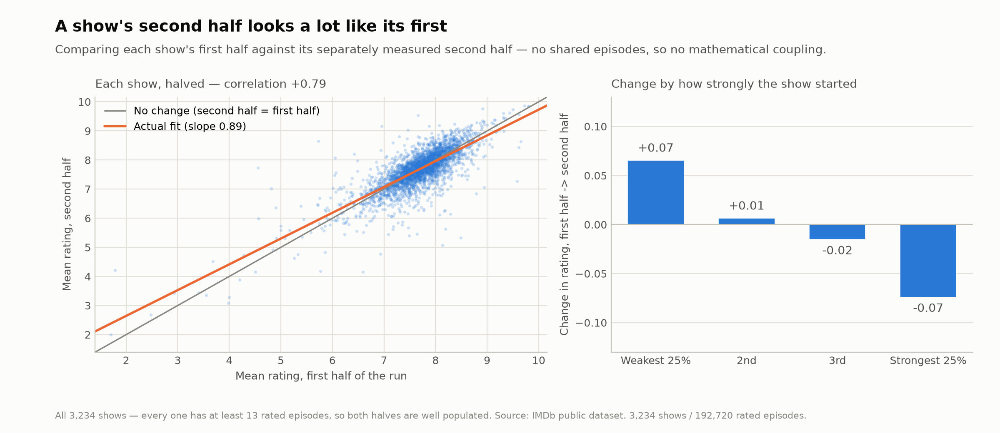
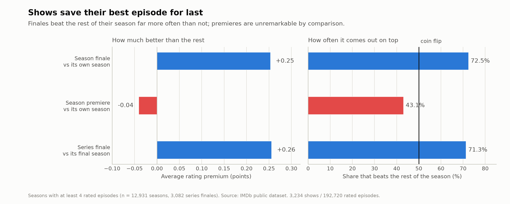
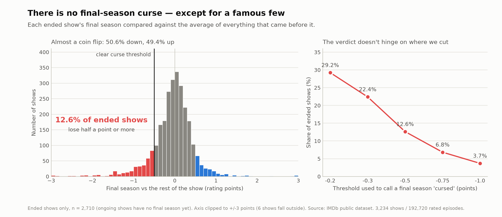
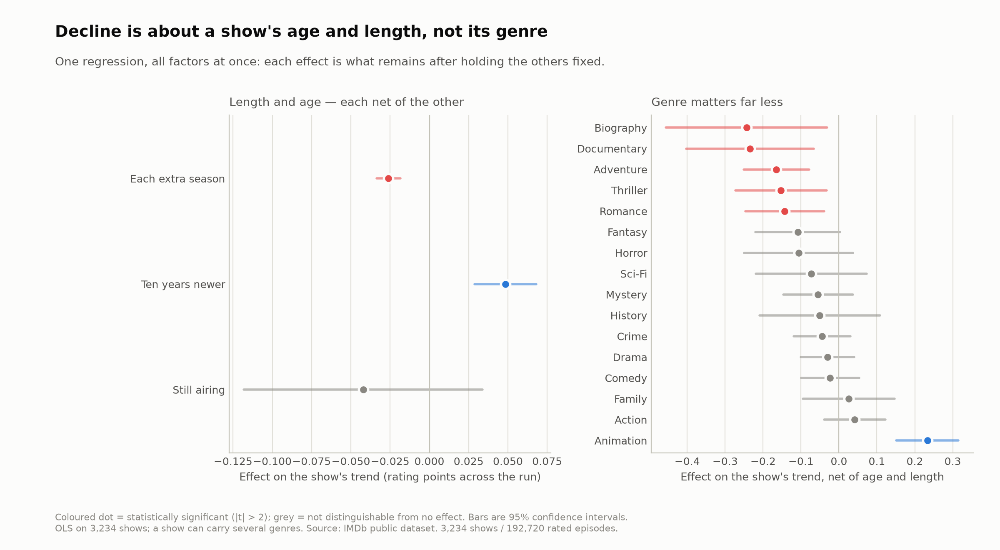
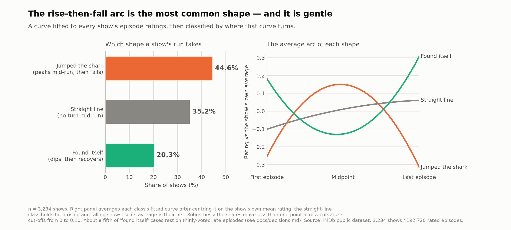
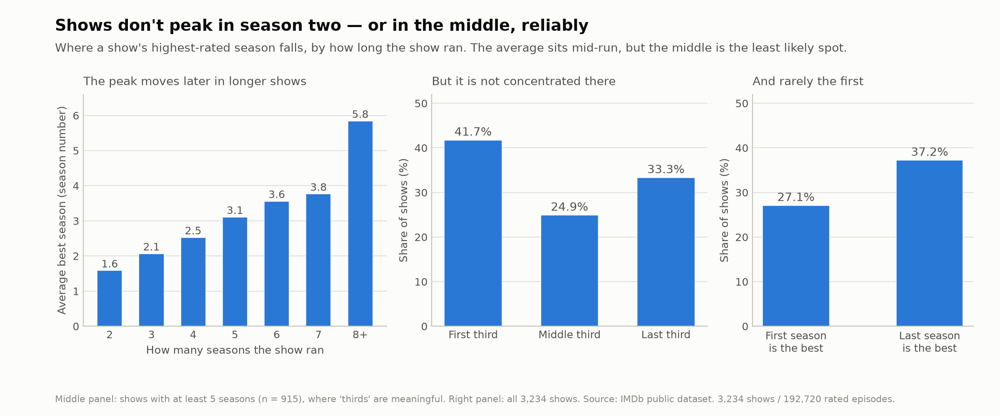
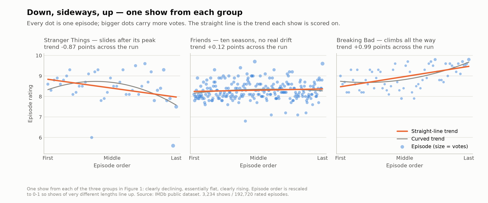
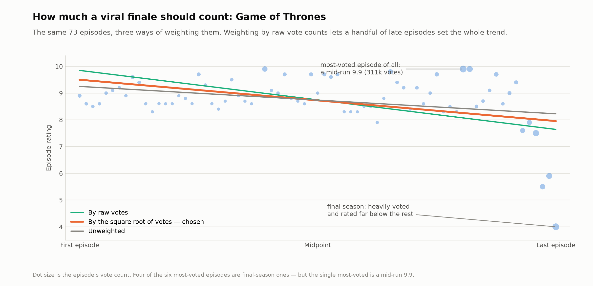

# Do TV Shows Really Decline?

> **Draft** — working narrative, not the final report. Figures are final
> (`notebooks/phase3_figures.py`); the prose around them is still being
> tightened. Structure follows `report_outline.md`; every number here is backed
> by the analysis logged in `decisions.md`.
>
> **Voice** (chosen from the hook tests): conversational and second-person —
> pull the reader into their own memory, then flip the belief with the
> numbers. Bold but never dry. (Blend of the "C" personal + "A" contrarian
> registers; the cinematic "B" register was rejected.)

## 1. The show that stayed too long

Think of a show you loved that stayed on too long.

Got one? Now the uncomfortable question — and be honest, because your memory
has a stake in the answer. Was that show *actually* worse by the end? Did the
writing genuinely rot, the characters flatten, the spark drain out of it? Or
did the ending simply let you down, and does a fresh disappointment shout
louder than the dozens of quiet, good episodes that earned your love in the
first place? We are, all of us, far better at remembering how a story left us
than how it treated us along the way.

Whatever you answered, you did not answer alone. We all carry the same
conviction, worn so smooth by repetition that it passes for common sense:
television declines. Shows arrive brimming with promise, spend their best
ideas too early, and coast downhill to a finish nobody asked for — *Game of
Thrones*, *Dexter*, *The Walking Dead*, pick your own heartbreak. It reads
less like an opinion than a law of the medium.

So we put it on trial. We pulled the episode ratings from IMDb — **192,720
episodes across 3,234 shows** — and traced where each show's ratings actually
travel, from premiere to finale.

The law is wrong.

## 2. Most shows just don't decline

Draw a straight line through a show's episode ratings, first to last, and you
have its whole life in a single number: how much it gained or lost between the
pilot and the finale. Do that for all 3,234 shows and the belief falls apart on
the very first count:

- A *clear* decline — giving up at least half a rating point across the whole
  run — turns up in just **16.9%** of shows. Fewer than one in six.
- The largest group by far, **57.4%**, is essentially flat: no real rise, no
  real fall.
- **25.7%** clearly *rise*, judged by that same half-point bar. Climbers
  outnumber decliners three to two.
- The median show doesn't sag at all — it drifts slightly *up*. Ignore the size
  of the move and simply count directions, and it still tips that way: for
  every three shows that drift down, four drift up.

**Figure 1.** Every show's trend, first episode to last. The distribution is a
hill sitting just to the right of zero. The declining tail is real — but it is
a tail.

If shows really coasted downhill, we'd expect a room full of falling lines.
Instead most of them hold their ground, and more climb than fall.

And they hold on more stubbornly than you'd guess. Split any show down the
middle and compare its first half to its second: the two track each other
almost perfectly (a +0.79 correlation). Even the shows that open strongest —
the top quarter, averaging an 8.3 — surrender a mere **0.07 of a point** by
their back half. Whatever drama plays out inside a single season, a show's
overall quality barely budges from beginning to end.

**Figure 2.** Each show's first half plotted against its separately measured
second half — no shared episodes, so nothing is being compared with itself. The
cloud hugs the line of no change, and the panel beside it shows how little even
the extremes move.

Which leaves a puzzle. If the numbers are this clear, why is *everyone* —
including you, thirty seconds ago — so sure that shows fall apart?

That gap is the real story. Here's where it comes from.

## 3. The finale is a victory lap, not a car crash

If a show is going to break your heart, you know exactly when it happens: the
end. The finale is where *Game of Thrones* detonated, where *Dexter* became a
punchline, where a decade of goodwill goes to die. So the finale should be the
low point — the moment the long decline finally lands.

It's the high point.

Go season by season through all 3,234 shows and the season finale is, more
often than not, the best episode in its season — it beats the rest of its own
season **72.6%** of the time, by a quarter of a point on average. Shows save
their strongest hour for last. And, tellingly, they don't do the reverse: the
season *premiere* is thoroughly unremarkable, no better than some random
mid-season episode. Television builds toward endings; it doesn't coast away
from beginnings.

The series finale — the very last episode a show ever airs — plays by the same
rule. It lands *above* its final season's average **71.6%** of the time. Only
about **one in ten** finales falls hard enough to count as a real collapse.

**Figure 3.** Season finales beat the rest of their own season nearly three
times out of four; premieres are unremarkable by comparison. The very last
episode a show ever airs behaves like every other finale — it goes out high.

That one in ten is simply the one you remember. *Dexter*, *How I Met Your
Mother*, *Power*, *You*, *Veronica Mars* — the infamous flops are real, and the
data registers every one of them (*How I Met Your Mother* spent its last season
around a 7.6, then signed off at a 5.5). But for every one of those, there's a
handful that sign off the way *The Office*, *The Big Bang Theory*, *Brooklyn
Nine-Nine*, and *Star Trek: The Next Generation* did — each of them closing on
an episode rated a full two points above the season around it, the audience on
its feet.

The finale you dread is the exception. The finale as a curtain call is the
rule.

## 4. The curse that only strikes the famous

Fine — a finale is one episode. Maybe the rot is bigger than that. Maybe it's
the whole final *season* that goes soft: the writers spent, the budget
stretched, the story limping to its contractual end. *That's* the real final-
season curse, and *Game of Thrones* is its patron saint — a last season
averaging a 6.4 against a 9.0 for everything that came before.

So we measured it head-on. For every show that has actually finished, we set
its final season against the rest of its run.

There is no curse.

Across ended shows it's almost a coin flip: **50.6%** have a weaker final
season, **49.4%** have a stronger one, and the middle of the pack moves by
essentially nothing. On average, a final season is just another season.

But — and this is where the belief gets its oxygen — a genuine collapse *does*
strike a small minority. About **one in eight** shows (12.6%) sheds half a
point or more at the end. Look at who they are: *Game of Thrones* (down 2.5
points), *Master of None* (down 2.5), *The Promised Neverland* (down 2.3) —
the kind of collapses that launch a thousand angry threads. The curse is real.
It's just rare — and it keeps landing on the shows people actually cared
about.

**Figure 4.** Every ended show's final season, set against the rest of its run.
The bulk of the distribution sits on zero; the curse is that red left tail —
and it stays a minority wherever the line is drawn.

Which might be the entire trick. (This part is interpretation, not something
the numbers prove.) The shows that fall are the shows *everyone* watched fall.
No group chat ever erupted over some quiet drama that slipped a point in
season four. When your evidence is only the collapses loud enough to make
noise, "final seasons are cursed" hardens into law — while the seven-in-eight
shows that ended perfectly fine never come up.

## 5. Decline is real — just not where you're looking

We have spent four sections tearing the belief down. Time to be fair: decline
*is* real. It simply isn't lurking where you'd look for it, and it has almost
nothing to do with a show "running out of ideas." It comes down to two
unglamorous facts about a show — and, if you insist, a genre.

**The first is length.** The longer a show runs, the more it wears down. Series
that wrap up in two or three seasons mostly hold steady or climb; among shows
that grind on for six seasons or more, a clear majority — **61%** — decline.
Every extra season tilts the odds a little further downhill. Which quietly
reframes the whole story: many of the shows we remember as "declining" are
really just the shows that would not *end* — the ones that outran their story
and kept airing anyway.

**The second is age.** Older shows sink; newer ones rise. Series that premiered
before 2000 mostly trend downward over their run; nearly everything since
trends up — and it holds even after you account for length, so it isn't simply
that old shows ran longer. Why? (This is interpretation, not proof.) The modern
hit is short, serialized, and plotted end to end, engineered to build toward a
payoff. The classic network show was episodic and open-ended, built to run
forever — and forever tends to plateau, then sag.

**And genre?** Mostly a red herring. Hold age and length constant and the
giants — drama, comedy, crime, action — come out flat, none of them cursed or
blessed by their label. Only a couple of categories truly break from the pack:
animation quietly *climbs* (those long-running cartoons and anime that sharpen
with age), while documentary and biography fade.

**Figure 5.** One regression, every factor at once, so each effect is what
remains after the others are held fixed. Length and age each survive that test.
Almost every genre does not: the grey intervals straddle zero, meaning the
label tells you nothing about which way a show will go.

So "do shows decline?" finally has an honest answer. Some do — but less because
they got worse, and more because of how old they are, and how long they
refused to stop.

## 6. Nobody peaks where you think

Two smaller myths travel with the decline story, and the data retires both.

Start with the louder one: that a show enjoys a "golden age" early and it is
all downhill from there. Here the data half-agrees, and it's worth being
precise about how. The single most common trajectory — about **45%** of shows
— really is an arc: a climb to a peak, then a drift back down. It is the
closest thing in the numbers to "jumping the shark."

**Figure 6.** The rise-then-fall arc is the single most common shape a run
takes. Look at the vertical scale on the right, though: the entire arc plays
out inside a few tenths of a rating point.

But two facts drain the melodrama out of it. First, the peak isn't early: on
average it lands near the *middle* of a show's run, and it slides later the
longer the show goes — a three-season show peaks around its second year, a
long-runner somewhere in its middle years. (That famous "second-season surge"?
Mostly an illusion created by how many shows are short.) Second — and this is
the part that matters — the arc is *gentle*. Recall the very first thing we
found: the average show ends within a whisker of where it began. The hump is
real. It's a hill, not a cliff.

Chasing that peak retires the second myth almost in passing: *the first season
is always the best.* It usually isn't. Across our shows, the single strongest
season is the *last* one more often (**37%**) than the *first* (**27%**). A
show is likelier to save its best for the end than to open on it.

**Figure 7.** Where a show's best season falls. The peak drifts later the
longer a show runs (left), yet it is not concentrated in the middle (centre) —
and the first season takes the crown less often than the last (right).

So yes, shows tend to rise, peak, and ease back down. They just peak later, and
slide far less, than the legend swears they do.

## 7. How we kept from fooling ourselves

A conclusion this far from common sense deserves suspicion — including our own.
So we spent as much effort trying to break these findings as making them. A few
of the traps we had to climb back out of, because each one is the difference
between a real result and a confident mistake.

**What counts as a show.** Three IMDb tables, joined so that every row is one
rated episode of one series. Then a bar to clear, because a trajectory needs
enough show to have one: at least 13 rated episodes, at least two seasons, and
an average of at least 50 votes per episode, so we're reading signal rather than
noise. Game shows, reality TV, talk shows and news are excluded outright —
"decline" is a claim about a story, and those formats aren't telling one. What
survives is **3,234 shows and 192,720 episodes**, everything from two-season
miniseries to the 806 episodes of *The Simpsons*.

That population is the whole essay, and behind every percentage in it sits a
picture like this one — a few dozen episode ratings and a line drawn through
them.

**Figure 8.** One show from each of the three groups in Figure 1. Every dot is
an episode, sized by how many people voted on it; the line through them is the
single number the show gets scored on. *Friends* is what "essentially flat"
looks like across ten seasons.

**Whose votes count.** Not every episode rating is equally trustworthy: a
finale rated by 300,000 people is a firmer number than a mid-season hour rated
by 80. But raw vote counts are their own trap — a show's most-voted episodes
are often its most *notorious* ones. Four of *Game of Thrones*' six most-voted
episodes come from its final season, every one of them rated far below the
show's own average: an audience that turned out mainly to register its
disappointment. Weight by raw votes and that late cluster hijacks the entire
trend. We settled on weighting by the *square root* of the vote count — enough
to trust popular episodes more, not so much that one viral meltdown speaks for
a decade.

**Figure 9.** The same 73 episodes, three ways of counting them. Weighting by
raw votes gives the steepest line of the three: the final season's backlash
drags the whole decade's trend down with it.

**The sentence we got wrong.** A smaller confession, and the reason we re-run
everything. That *Game of Thrones* observation first went into our notes as
*"its two most-voted episodes are its last two"* — a tidy line that made the
point beautifully. It was also false. The show's single most-voted episode is
the big dot near the top of Figure 9: a mid-run 9.9, one of the most beloved
hours it ever aired. We caught it only by finally running a script we had
written and never actually executed.
The conclusion held; the sentence propping it up did not. Headline findings get
scrutinised. It's the confident little sentences *around* them where mistakes
survive.

**The trap we nearly fell into.** Early on, a number told us high-rated shows
decline hard: a strong −0.37 link between where a show starts and how it
trends. It looked like a headline. It was an artifact — we had correlated each
show's trajectory with its *own* starting point, and when one estimate feeds
both sides of a comparison, it manufactures a relationship out of thin air. The
honest version compares a show's first half against its *separately measured*
second half — Figure 2 — and there the effect nearly evaporated: the
highest-starting shows give up all of 0.07 of a point. A finding we would have
happily published was mostly a mirage — and the reason we now distrust any
single number until it survives a cleaner test.

**Untangling the culprits.** "Newer shows rise," "shorter shows rise," "older
shows decline" sound like three separate discoveries — but newer shows *are*
shorter, so they might be one discovery in three costumes. We pulled them apart
with a model that holds the others fixed, and both age and length survived on
their own. Two real forces, not a single confound in disguise.

**Where the data thins out.** One pattern — shows that dip and then "find
themselves" again — looked solid until we noticed that a show's late episodes
are precisely its *least*-voted ones (audiences thin out; only the diehards
keep rating). For about a fifth of those shows, the late "recovery" leaned on a
handful of low-vote episodes and dissolved the moment we demanded firmer
numbers. So we treat anything resting on a show's final stretch as the shakiest
ground in the dataset — and say so out loud.

None of these checks moved the headline. They changed how much we trust it,
which is exactly the point.

## 8. What the numbers can't see

Every finding here rests on one blunt proxy: a show's IMDb episode ratings.
That buys us 192,720 data points — and a few blind spots worth naming plainly.

**A rating never says *why*.** Our method sees a show's score fall; it has no
idea what pushed it. And the push often comes from off-screen, not from the
writing:

- *House of Cards* has the single steepest final-season crash in our entire
  dataset — **down 4.2 points**, far past the 2.6 that made *Game of Thrones*
  infamous. The writing didn't rot; its lead actor was written out amid
  scandal, and the last season was rebuilt without him and cut from thirteen
  episodes to eight.
- *Top Gear* didn't run out of ideas either. Its star, Jeremy Clarkson, was
  fired in 2015 after an altercation with a producer, his two co-hosts left
  with him, and what happened next shows up in our numbers as a two-point
  drop — one of the largest we measured.
- *Two and a Half Men* lost its lead the same way — Charlie Sheen was fired
  mid-feud and written out — and no amount of Ashton Kutcher held the room.
- *Scrubs* "declined" in its ninth season only because it had quietly become a
  different show: new cast, new setting, a soft reboot wearing the old name.
- Even *Game of Thrones*, patron saint of the decline story, has an off-screen
  culprit — it sprinted past the novels it was adapting, and wrote its final
  seasons without a map.

To our numbers, these are all just "decline." A fired actor, a punched
producer, and a novelist who hadn't finished the books look identical to a show
that simply lost its spark. We can measure the fall; we can't read its cause.

**The crowd isn't the audience.** IMDb scores come from whoever chose to log in
and vote — a self-selected, disproportionately online crowd, not a
representative sample of viewers. And that crowd organises: some of the
lowest-scored episodes in our data were rated down in anger, review-bombed by
fans lodging a protest rather than an opinion. Weighting by vote count blunts
this; it doesn't erase it.

**A few formats slipped the net.** Our filters aim at scripted, narrative
shows, but a handful of sketch and variety programs wear the "comedy" label and
sneak through — *Saturday Night Live*, a thousand-plus episodes of it, is not
the season-arc story we set out to measure. A rounding error, not a distortion
— but it's there.

None of this sinks the headline: most shows still don't decline, and the finale
is still usually a peak. It just draws the honest border around what an
analysis like this can claim. We can map *where* television ratings move, and
*how much*. The *why* belongs to a messier world the numbers can't see.

## 9. The show you were thinking of

So — back to your show. The one you picked in the first paragraph.

It might genuinely have fallen apart. One in six do, and someone has to be that
one. But the odds are against it, and there's a fair chance your show is *Lost*.

If any series is shorthand for betrayal, it's that one: six seasons of
questions, an ending people have been arguing about since 2010, the standing
punchline for a show that lost the plot. Here is what its ratings actually did.

Season one averaged 8.54. Season six averaged 8.32. That is the entire
collapse: 0.22 of a point. Two consecutive *Lost* episodes differed by more
than that on an ordinary week, 69% of the time. And that worst-ever season
still beats the best season three out of four shows in our data ever managed.
Across all 121 episodes the trend line is flatter than 98% of everything we
measured; of the 499 shows that ran past a hundred episodes, exactly twelve
hold a straighter one. The pilot scored a 9.1. The finale that supposedly
ruined everything is rated 9.2 today — the eighth-best-rated hour the show ever
aired.

*Lost* never declined. We only remember it that way.

Which is the whole finding, in one show. The disappointment is real — but it is
a fact about endings, not about series.

We are, all of us, far better at remembering how a story left us than how it
treated us along the way.
